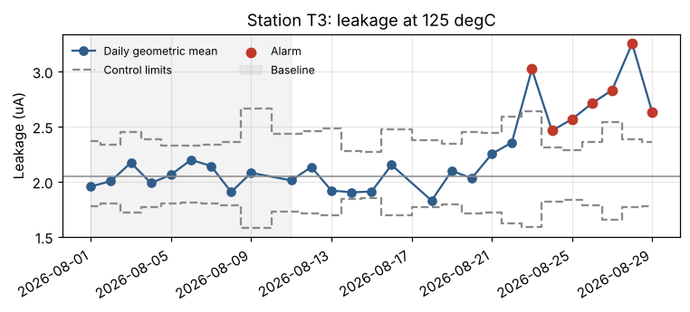
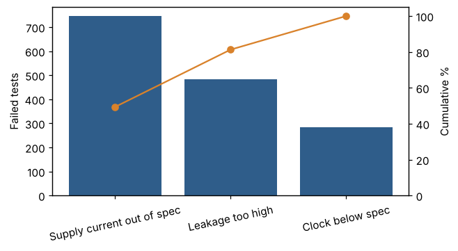

# MCU Test Analytics

A Python and SQL pipeline that turns raw end-of-line test data for automotive microcontrollers into checked, reportable KPIs: it validates the data, quarantines bad rows with a reason, computes first-pass and final yield in SQL, watches each test station with a control chart, and writes an HTML report plus tidy CSV extracts for Tableau or any other BI tool.

**All data is synthetic.** The generator in `src/mcu_analytics/generate.py` creates one month of tests for 12,000 units, each tested at -40, 25 and 125 degC. Product names, limits and distributions are invented, and so are the problems the pipeline has to find.



## What it does

```
generate -> validate -> clean / quarantine -> SQLite + KPI views -> SPC -> report.html + Tableau CSVs
```

1. **Data quality rules (`validate.py`).** Seven rules check every row: duplicates, missing measurements, physically implausible leakage (a unit error), invalid temperatures, timestamps in the future, a PASS result with a fail bin, and lots missing from the master data. Duplicates are dropped; every other flagged row goes to `quarantine.csv` with its reasons, so nothing disappears silently.
2. **KPIs in SQL (`sql/kpis.sql`).** Views compute retest attempts with `ROW_NUMBER()`, first-pass and final yield per unit and lot, yield by temperature, a 7-day rolling pass rate per station, and a fail-bin Pareto with cumulative share.
3. **Statistical process control (`spc.py`).** An X-bar chart per station on log(leakage) at 125 degC, with limits from a 10-day baseline that adjust to each day's sample size, plus Cpk per parameter and temperature.
4. **Report and exports (`report.py`, `pipeline.py`).** One self-contained `report.html` and six CSVs in `output/tableau/`.
5. **Notebook (`notebooks/exploration.ipynb`).** Walks through the same steps and answers one question: is the leakage rise on station T3 a data problem or a process problem?

## Results (seed 7)

| | |
|---|---|
| Rows in | 37,261 |
| Duplicates dropped / rows quarantined | 280 / 495 |
| Units | 12,000 |
| First-pass yield / final yield after retest | 88.42 % / 95.43 % |
| Largest fail bin | Supply current out of spec, 49 % of fails |
| SPC alarms | T3 from 23 Aug (real drift), T4 on 27 Aug (one-day false alarm) |
| Runtime | about 5 s |

**Data quality.** In the tests, each rule flags exactly the rows that were injected with that problem, on three different seeds, and a dataset with no injected problems raises zero flags. That is a check of the rules against known answers, not proof they would catch every problem in real tester data.

**Process control.** The generator adds a slow leakage drift on station T3 from day 18. `scripts/evaluate_spc.py` repeats the whole pipeline on 20 simulated months:

```
Drift on T3 detected: 20/20
Days from drift start to first alarm: median 3.0, range 1-6
Stable station-months with at least one false alarm: 4/60
```

The default run includes one of those false alarms (T4, a single day with a low mean). I kept it visible in the report rather than picking a seed that hides it. A second rule (nine days in a row on one side of the center) fired far more often on stable stations, because the center comes from only ten days, so it is reported as a warning and does not raise the alarm.



## Run it

```bash
python -m venv .venv && source .venv/bin/activate      # Windows: .venv\Scripts\activate
pip install -e ".[dev]"
mcu-analytics --out output                              # pipeline, about 5 s
pytest -q                                               # 23 tests
python scripts/evaluate_spc.py --seeds 20               # SPC detection and false alarms
jupyter notebook notebooks/exploration.ipynb
```

Open `output/report.html` in a browser. `output/mcu_tests.db` is a SQLite file you can query directly, for example in DB Browser for SQLite.

## Project layout

```
src/mcu_analytics/
  generate.py      synthetic data and injected problems
  validate.py      data quality rules, clean / quarantine split
  sql/kpis.sql     KPI views (window functions)
  kpis.py          load into SQLite, read the views
  spc.py           control chart, Cpk
  report.py        HTML report with charts
  pipeline.py      CLI that runs everything
notebooks/         exploration notebook (executed, outputs saved)
scripts/           SPC evaluation, notebook and README image builders
tests/             pytest suite, runs in CI with ruff
docs/              data dictionary, Tableau guide
```

## Limitations

- Synthetic data: real tester logs have more parameters, test programs that change over time and far messier failures.
- The validator only knows the problems it has rules for. A new kind of error needs a new rule.
- Cpk for leakage uses raw values although leakage is skewed, so it is an approximation.
- Units missing an insertion because a row was quarantined still count toward yield with the insertions they have.

See `docs/data_dictionary.md` for every column and `docs/tableau_guide.md` for building a dashboard on the exports.
